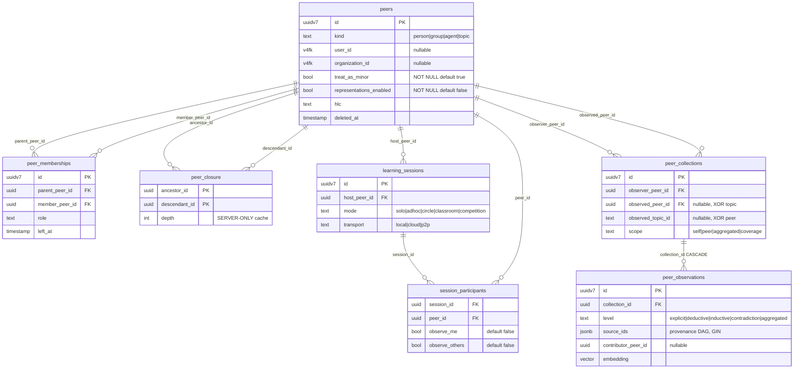
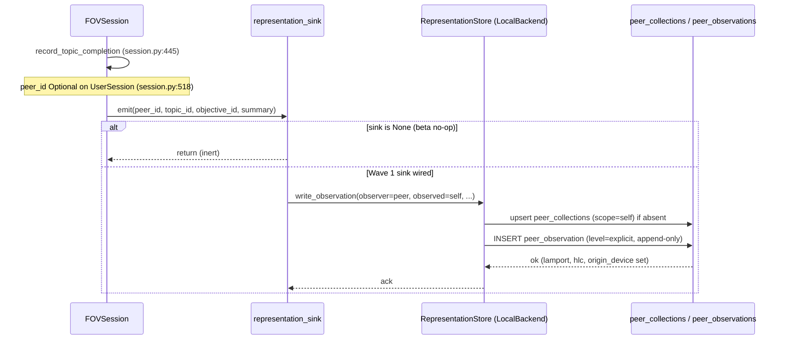
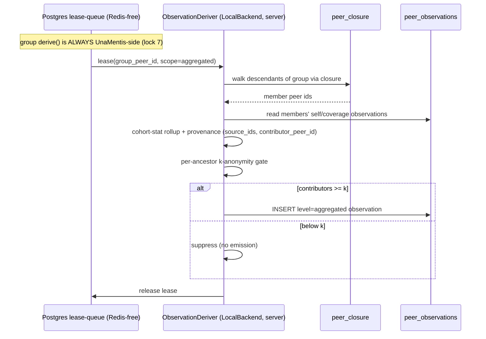
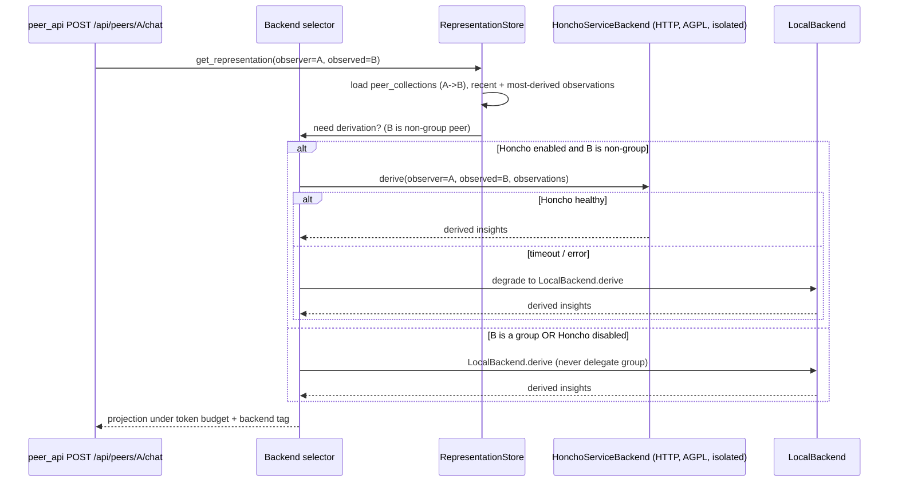
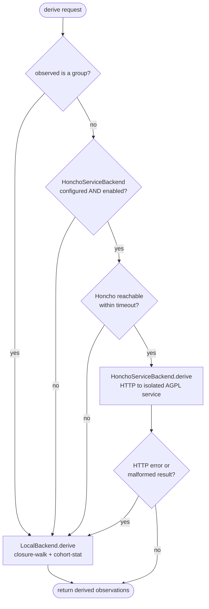

# Peers and Representations: Technical Design

Status: comprehensive technical design, 2026-06-26. Pending ratification of direction.
Companions (this document supersedes neither, it builds on both): [HONCHO_AND_GROUP_LEARNING_2026-06-26.md](HONCHO_AND_GROUP_LEARNING_2026-06-26.md) (the first scan) and [PEER_REPRESENTATION_ARCHITECTURE_2026-06-26.md](PEER_REPRESENTATION_ARCHITECTURE_2026-06-26.md) (the decision record with the build-vs-fork analysis and the ten locks). This document tells the whole story from premise to implementation.

Reading guide: Part I is the premise and the reasoning that got us here. Part II is what the layer does and why it matters, grounded in five worked scenarios. Part III is the architecture. Part IV is the implementation detail. Part V is delivery, risk, and the decisions to ratify.

---

# Part I. The premise

## 1.1 What was brought to the table

This work began with a single observation. UnaMentis can teach one person in one session very well, and it can do that on-device, but it has no memory of a learner across sessions, and it has no concept of people learning together. We brought Honcho (honcho.dev, by Plastic Labs) to the table as a candidate answer. The pitch that made it interesting was not "a database for chat history." It was the claim that an agent should carry a *representation* of whoever it is talking to, a model of what they understand and how they think, that deepens over time, and that this representation should be queryable: you should be able to ask the system "what does this person understand about X," and, more provocatively, "what does person A understand about person B."

That last capability is the one that mattered to us. A learning platform that can hold a model not just of a learner but of a *group*, and that can reason about what one learner knows relative to another, is a different kind of product. It is the substrate for study groups, for classrooms, for trivia teams, for peer tutoring, for the whole range of "let's learn this together" that a single-learner app cannot touch. Honcho put a name and a working implementation on a pattern we wanted.

The working assumption going in, and it turned out to be correct, was that we probably would not *use* Honcho itself, but that it represented a pattern we should own. This document is the verification of that instinct and the design that follows from it.

## 1.2 What Honcho actually is

Stripped of marketing, Honcho is a server that maintains, for each entity it tracks, a directed model of "what observer O has come to understand about subject S," built by reading messages and reasoning over them in the background. Its primitives are worth stating precisely, because we keep the good ones:

- A **Peer** is any entity with an identity: a person, an agent, and, semantically, a team or an organization.
- A **Session** is a conversation context, related to peers many-to-many.
- A **Message** is an atomic unit inside a session, labeled by its source peer.
- A **Collection** is the load-bearing idea: a directed edge keyed by `(observer, observed)`. When observer equals observed, it is a peer's self-knowledge. When they differ, it is one peer's theory of mind of another.
- A **Document** is an append-only observation under a collection, carrying an epistemic level (explicit, deductive, inductive, contradiction) and a `source_ids` provenance link to the observations it was reasoned from.
- A **Representation** is not stored. It is assembled at query time from the documents in the relevant collection.
- The **Dialectic** endpoint lets you ask a natural-language question *of* a representation. The **Dreamer** runs background reasoning to derive higher-level beliefs.

We read the actual source (AGPL-3.0, roughly 38,500 lines) rather than the docs. The directed `(observer, observed)` collection, the append-only observation log with a level lattice and a provenance DAG, the Redis-free Postgres lease-queue that drives derivation, and the budgeted projection that assembles a representation are all genuinely good engineering. They are the parts we keep, as concepts.

## 1.3 The investigation

We did not decide by taste. We ran a structured investigation: a deep code dive across five Honcho subsystems (data model, the derivation engine, the dialectic query path, the dreamer and its spatial index structures, and the infrastructure), plus four strategic threads (the AGPL license, recursive-group data modeling, our own integration surface, and prior art). We then had three full architectures argued at their strongest (fork Honcho, build clean-room, or a hybrid), scored by a three-judge panel, and put through adversarial review whose explicit job was to find the assumption that would force us to re-architect later. Every claim about our own code below is verified against the current tree with file and line citations.

## 1.4 The verdict: the pattern, not the product

Three findings, each verified, turned the instinct into a decision.

**Finding 1: Honcho's peers are structurally flat.** This is the decisive one. In Honcho's schema (`src/models.py:130`), a Peer has no self-referential foreign key, no parent, no group membership table anywhere. A peer can be *named* "acme-corp," and the prompts even say a peer "can be a team, an organization," but the database gives it zero structural support for *containing* other peers, and there is no rollup of member knowledge into a group. The single most important thing we need, a group that is itself a peer and can contain other groups, recursively, is exactly the thing Honcho does not have. Even if we adopted Honcho wholesale, we would have to build recursive groups ourselves.

**Finding 2: AGPL plus the App Store closes the door on-device.** Honcho's server is AGPL-3.0 (verified: the `LICENSE` is verbatim Affero GPLv3; `src/main.py` declares `AGPL-3.0-only`). For an open-source project that publishes its source, AGPL is not a philosophical problem, and paid hosting of the published server is fully AGPL-compatible. But two technical frictions are real and independent of all of that. First, shipping AGPL or GPL-family code inside an iOS app distributed through the App Store conflicts with Apple's distribution terms (the documented VLC precedent). That rules AGPL code out of the on-device binary, and the on-device, two-phones-no-internet tier is precisely our differentiator. Second, importing AGPL code in-process would impose AGPL on the components it links into. The clean boundary, the one Honcho's own Apache-2.0 SDK demonstrates (it is a pure HTTP client that imports none of the AGPL server), is a network boundary.

**Finding 3: Honcho is structurally a server, and we are structurally on-device-first.** Its `Document` storage hard-binds pgvector with an HNSW index (`src/models.py:379`). Its derivation assumes an always-on worker and a frontier LLM. None of that can run on a phone, offline, which is the tier that makes group learning on UnaMentis genuinely different from everyone else's.

The conclusion writes itself. We do not adopt the product. We adopt the pattern, the directed observer/observed collection over an append-only, provenance-linked observation log, projected into a representation at query time, and we build it ourselves so that it is recursion-native, runs identically on a phone and a server, and carries no copyleft into the binary.

## 1.5 What we are building, in one sentence

A clean-room peer-and-representation engine that is the permanent contract of the platform: a group is a kind of peer (recursion via one self-referential edge), the identical model runs on phone SQLite and server Postgres, heavy reasoning sits behind two swappable interface seams, and an optional, network-isolated, source-published Honcho service may plug in later for server-tier reasoning of individual (never group) peers, degrading gracefully to our own engine.

This is not a "simple v1." The model is complete on day one. Only the build is phased.

---

# Part II. What this does and why it matters

## 2.1 The capability, in plain terms

The layer gives every learner a memory that persists across sessions and devices, and it gives every *group* of learners a shared, collective memory of what the group has covered and where it is stuck. It lets the system reason about one learner's understanding relative to another's. And it does all of this under one model whether the group is two friends on a train with no internet or a school district of thousands.

Three nouns carry the whole design:

- A **peer** is a person, an agent, a topic, or a **group**. A group is just a peer with `kind = group`.
- A **collection** is a directed `observer to observed` edge: self-knowledge when they match, theory of mind when they differ, coverage when the observed is a topic.
- An **observation** is an append-only fact under a collection, with an epistemic level and a provenance link.

A **representation** is what a caller receives. It is a projection computed over observations at query time, never a stored blob. That single discipline, projection over an append-only log rather than a mutable summary, is what makes the whole thing converge across devices and erase cleanly for minors.

## 2.2 The spectrum is one model

The reason this matters architecturally is that the entire range the platform wants to serve, from the most casual self-organizing pair to the most rigid top-down institution, is the *same data model at different depths*:

- Two people self-organizing ("you're you, let's learn this together") is two person-peers, one group-peer, two edges.
- A study group, a competition team, or a classroom is a group-peer with member edges and a roster.
- An institution with departments and sub-departments is groups nested inside groups, arbitrarily deep.
- A learner who belongs to both a class and an after-school team is a node with two parents.

Group-ness is recursion, not a new schema. Moving from a trivia pair to a district does not change the model, it changes the depth of the membership tree and the host the model runs on.

## 2.3 Theory of mind is the differentiator

A plain vector database can answer "what has this learner studied." It cannot cleanly answer "what does Devon understand that Priya does not yet, on this topic." That second question is a directed `(observer, observed)` collection, and it is the foundation of peer tutoring, of a facilitator scaffolding a discussion, and of a classroom dashboard that shows where the *class* is stuck rather than profiling each child. It is the capability we came to Honcho for, and it is the one we are keeping.

## 2.4 Why it matters to UnaMentis specifically

- It is the natural home of the **Socratic Engine** vision. Cross-member Socratic dialogue, where the facilitator works the seams between what different learners understand, is exactly a theory-of-mind query over multiple representations.
- It turns the existing **Knowledge Bowl** module into a genuine team experience: a team's collective coverage steering practice toward the gaps.
- It is **on-device-first by construction**. The serverless tier is not a degraded mode, it is the same model running on two phones with no server, which almost nobody else can offer.
- It reuses the **existing institutional schema**. The `organizations` table is already a recursive tree (`schema.sql:801`), so districts and schools and the consent and guardianship machinery are a bridge away, not a rebuild.
- It treats **privacy for minors as load-bearing**, not a bolt-on, which is both an ethical necessity and a real differentiator in education.

## 2.5 Five worked scenarios

These five scenarios trace the same model across its full span, an offline pair of phones up to a school district of thousands. In every case the mechanics are identical (peers, memberships, sessions, collections, observations). Only the tier, transport, and rollup depth change. Read them as proof that one model carries the whole spectrum.

### Scenario 1: Two friends on a train (ad-hoc pair, serverless)

**The story.** Maya and Jonah are riding a commuter train to a Knowledge Bowl meet. No Wi-Fi, spotty cell, twenty minutes to kill. They want to quiz each other on geography and science trivia and have the app keep the questions fresh, not repeat what they already nailed.

**What the system does.** Maya taps "Practice together." Her phone advertises a local peer-to-peer link; Jonah joins. On Maya's device three rows are minted in local SQLite, all UUIDv7, all `is_local_only = true`:

- `peers`: two rows `kind = person` (Maya, Jonah) and one row `kind = group`, `display_name = "Train Practice"`. A group is just a peer.
- `peer_memberships`: two edges, `parent_peer_id = <group>`, `member_peer_id = <Maya>` and `<Jonah>`, `role = member`.

A `learning_sessions` row is created: `host_peer_id = <group>`, `mode = adhoc`, `transport = p2p`, `curriculum_id` = the trivia deck. Two `session_participants` rows join Maya and Jonah. Each privately flips `observe_me = true` (consent, protective default is false). Nobody is observed who did not opt in.

For each opt-in participant, a self `peer_collections` edge is written: `observer_peer_id == observed_peer_id` (self-knowledge), `scope = self`. As Jonah answers "Mount Aconcagua" correctly, the on-device small LLM (Qwen3-1.7B / Gemma-class) does cheap explicit-fact extraction and appends a `peer_observations` row: `level = explicit`, `topic_id = "geography.peaks"`, `mastery` near 0.9, `confidence` set, `coverage_count = 1`. No embeddings (Tier 0 has none).

Both phones run the identical LocalBackend. Observations replicate device-to-device over an OR-Set carrying the CRDT columns (`lamport`, `hlc`, `origin_device`). Because the graph is tiny, the group's coverage is computed by a recursive CTE, not a closure cache (`peer_closure` is server-only). The `derive()` for the group is always UnaMentis-side: it walks the two members, emits `scope = aggregated`, `level = aggregated` coverage observations with `source_ids` provenance, and feeds the next question selection. "You've both got peaks, try ocean trenches." The whole loop is on-device, offline, convergent.

### Scenario 2: The Wednesday philosophy circle (standing circle, cloud)

**The story.** Five adults in five cities meet weekly over the app to work through a philosophy curriculum. They want the facilitator (a Socratic agent) to remember, between meetings, what the circle as a whole has and has not grasped, and to let a member who missed last week catch up asynchronously.

**What the system does.** A persistent group exists: `peers` row `kind = group`, `display_name = "Wednesday Circle"`, `representations_enabled = true`, `treat_as_minor = false`. Five `peer_memberships` edges bind the members; one member carries `role = facilitator` (here an `agent` peer). This lives in Postgres (Tier 1), and `peer_closure` holds the transitive cache, trivial at depth 1 here but the same machinery scales later.

Each weekly meeting mints a fresh `learning_sessions` row: `mode = circle`, `transport = cloud`, `host_peer_id = <circle group>`, `curriculum_id` = the philosophy track. Members join as `session_participants` with `observe_me = true`, and many also `observe_others = true` (they consent to the circle modeling them).

During discussion, observations append to each member's self-collection: `level` ranges over `explicit` (a member states a definition) and `deductive`/`inductive` (the deriver infers understanding from how they argue). On the server, the Tier 1 deriver is a Redis-free Postgres lease-queue worker; it claims observation batches and writes derived rows. Critically, the group representation is never delegated to an external service: the closure-walk plus cohort statistics that produce the circle's `scope = aggregated, level = aggregated` coverage are always UnaMentis-side.

Between meetings the group accumulates a coverage representation: a runtime projection (recent plus most-derived plus a semantic blend over pgvector embeddings, under a token budget) answering "what has this circle not yet grasped about Chapter 4?" The facilitator queries `get_representation(observer = <circle>, observed_topic_id = "ch4", scope = coverage)` and opens Wednesday with exactly the unresolved tension. The async catch-up: the absent member's phone still holds local SQLite, syncs up the missed session's observations, and the deriver folds them into the group rollup so coverage reflects all five. A representation is a projection, never a stored blob; the log is the truth.

### Scenario 3: Ms. Okafor's 7th-grade class (top-down institutional, minors)

**The story.** Ms. Okafor teaches 28 students a life-science unit. She wants a dashboard showing where the class is stuck (a misconception map) and where individuals need help, without surveilling children or letting the app "think about" them off-hours.

**What the system does.** A class group exists: `peers` row `kind = group`, `display_name = "Period 3 Life Science"`, linked to the school via `organization_id` (existing v4 FK into the recursive organizations tree). The roster is edges: 28 `peer_memberships` rows, `parent_peer_id = <class>`, `member_peer_id = <student>`, `role = member`; Ms. Okafor is an edge with `role = instructor`.

Minors are the headline. Every student peer keeps `treat_as_minor = true` (the NOT-NULL DB default, never overridden here) and `representations_enabled` stays opt-in; nothing is modeled until a guardian consents. There is no "dreaming": no off-session derivation passes run on minor peers. In session, `session_participants.observe_me` defaults false and is enabled only under consent.

Each consented student gets a self-collection (`observer == observed`, `scope = self`) accumulating `explicit`/`deductive` observations tied to `objective_id`s in the curriculum. The class misconception map is a `peer_collections` edge `observer = <class>, observed_topic_id = "cells.osmosis", scope = aggregated`. The rollup walks the roster and emits `level = aggregated` observations, but it passes through a per-ancestor k-anonymity gate: if fewer than *k* students cover an objective, the cohort stat is suppressed so no individual is re-identifiable from the aggregate. `contributor_peer_id` provenance is retained internally for erasure, not exposed.

Ms. Okafor's dashboard issues one query: `get_representation(observer = <class>, observed_topic_id = ..., scope = coverage)`. She sees "19 of 28 hold a misconception about osmosis direction," a class-level signal, not a per-child dossier. If a guardian later revokes consent, the typed FK `observed_peer_id` lets a DB cascade purge that student's observations cleanly. Everything is Tier 1 (cloud Postgres), escalating toward Tier 2 as the school's org tree deepens.

### Scenario 4: Riverside District (org-of-orgs, the recursive payoff)

**The story.** Riverside Unified spans 6 schools, dozens of classes, thousands of students, plus after-school teams that cut across classes. The curriculum director wants coverage rollups at every level (district, school, class) from the same data, and a few students belong to two groups at once.

**What the system does.** This is the recursion paying off. Every level is a `peers` row with `kind = group`: the district, each school, each class. `peer_memberships` nests them: `parent = <district>, member = <school>`; `parent = <school>, member = <class>`; `parent = <class>, member = <student>`. A member can itself be a group, so the same edge type stacks arbitrarily deep. `organization_id` ties group peers into the existing recursive organizations table (Tier 2).

Because the graph is now large, the server maintains `peer_closure(ancestor_id, descendant_id, depth)` as a transitive cache. Asking "every student under Riverside" is one indexed read of the closure, not a runtime tree walk. Lock 10's conformance suite guarantees this server closure equals the device's recursive-CTE answer on diamond, multi-parent, and cycle graphs, so a phone offline computes the same membership the server does.

Multi-parent is first-class: Aisha is a `member` edge under `<Class 7B>` and a `member` edge under `<Robotics After-School Team>`. The closure simply lists her as a descendant of both ancestors; no special case. Her contributions roll up into both the class coverage and the team coverage.

Coverage rolls up at each tier by re-running the same group `derive()`: walk descendants via closure, emit `scope = aggregated, level = aggregated` observations with `source_ids` and `contributor_peer_id` provenance. The k-anonymity gate is per-ancestor: a tiny robotics team has a higher effective threshold relative to its size, so a 4-student team never leaks an individual even though the 600-student school easily clears *k*. The district director queries `get_representation(observer = <district>, observed_topic_id = ..., scope = coverage)` and drills down school by school, each level honest because group `derive()` is always UnaMentis-side, never delegated.

### Scenario 5: Devon helps Priya (peer tutoring, theory of mind)

**The story.** Devon has mastered quadratic factoring; Priya is stuck on it. The teacher pairs them. Devon wants the app to coach *him* on how to help, specifically: what does he understand that Priya does not yet, so he can scaffold instead of just giving answers?

**What the system does.** This is the theory-of-mind edge made concrete. Both are existing student `peers`. A short pairing group may be minted (`kind = group`, `mode = adhoc`), but the load-bearing object is a directed collection: `peer_collections` with `observer_peer_id = <Devon>`, `observed_peer_id = <Priya>`, `scope = peer`. This is "Devon's model of Priya," distinct from Devon's self-collection (`observer == observed`) and from any group's model.

A `learning_sessions` row (`mode = adhoc`, transport `cloud` or `p2p`) hosts the pairing; both join as `session_participants`. Priya's `observe_others = true` is consent: she agrees that Devon's session may inform a representation of her understanding. Without that toggle, no observer-to-observed edge is populated for her.

The scaffolding query is a dialectic over two representations: the system projects `get_representation(observer = <Devon>, observed = <Devon>, topic = "quadratics.factoring")` (what Devon knows) and `get_representation(observer = <Devon>, observed = <Priya>, topic = "quadratics.factoring")` (Devon's theory of Priya, seeded from her consented self-observations). The difference, "Devon holds the zero-product step, Priya's observations show a gap there," drives the coaching: "Ask Priya what makes the product equal zero before you show the split." As Priya works, new `peer_observations` append under the observer-to-observed collection (`level = deductive` as Devon infers her state, `level = explicit` when she states something), refining his model in real time. Because the observed FK is typed, if Priya later withdraws, a cascade erases Devon's model of her without touching his self-knowledge.

**The through-line.** Five stories, one model. A pair on a train and a district of thousands both reduce to peers, membership edges, sessions with consenting participants, directed observer-to-observed collections, and an append-only observation log projected at runtime into representations. Group-ness is recursion, not a new schema. Consent is a default, not a feature. And whether the work runs on two offline phones or a Postgres cluster, the contract in migration 006 is identical.

---

# Part III. Architecture

## 3.1 The one model

Seven tables in `server/database/migrations/006_peer_representation_stubs.sql` (the next migration number is confirmed 006; 002 through 005 exist). The same logical schema is created in on-device SQLite, with two documented divergences: `peer_closure` is server-only, and the `embedding` column is pgvector on the server and sqlite-vec or absent on device. All client-mintable IDs are UUIDv7; `user_id` and `organization_id` are foreign keys into the existing server v4 id-space, a deliberately separate, documented regime. Every syncable table carries the CRDT columns `lamport BIGINT`, `hlc TEXT`, `origin_device TEXT`, and a `deleted_at` tombstone (we never hard-delete). DDL below is illustrative, not final.

```sql
CREATE TABLE peers (
  id            UUID PRIMARY KEY,          -- UUIDv7, client-mintable, offline-safe (lock 1)
  kind          TEXT NOT NULL DEFAULT 'person'
                CHECK (kind IN ('person','group','agent','topic')),
  display_name  TEXT,
  user_id       UUID REFERENCES users(id) ON DELETE SET NULL,           -- v4 id-space (lock 1)
  organization_id UUID REFERENCES organizations(id) ON DELETE SET NULL, -- bridges existing org tree
  is_local_only           BOOLEAN NOT NULL DEFAULT true,
  treat_as_minor          BOOLEAN NOT NULL DEFAULT true,    -- protective default (lock 4)
  representations_enabled BOOLEAN NOT NULL DEFAULT false,   -- opt-in (lock 4)
  metadata      JSONB NOT NULL DEFAULT '{}',
  lamport BIGINT NOT NULL DEFAULT 0, hlc TEXT, origin_device TEXT,
  created_at    TIMESTAMPTZ NOT NULL DEFAULT now(),
  deleted_at    TIMESTAMPTZ                 -- tombstone (lock 3)
);

CREATE TABLE peer_memberships (             -- self-referential edge = arbitrary nesting
  id             UUID PRIMARY KEY,
  parent_peer_id UUID NOT NULL REFERENCES peers(id),
  member_peer_id UUID NOT NULL REFERENCES peers(id),   -- may itself be kind='group'
  role           TEXT CHECK (role IN ('member','facilitator','captain','instructor','guardian')),
  edge_config    JSONB NOT NULL DEFAULT '{}',
  joined_at      TIMESTAMPTZ NOT NULL DEFAULT now(), left_at TIMESTAMPTZ,
  lamport BIGINT, hlc TEXT, origin_device TEXT, deleted_at TIMESTAMPTZ,
  CHECK (parent_peer_id <> member_peer_id),
  UNIQUE (parent_peer_id, member_peer_id)   -- active dup reconciled via partial index on left_at/deleted_at
);

CREATE TABLE peer_closure (                 -- SERVER-ONLY transitive cache, not source of truth
  ancestor_id UUID NOT NULL REFERENCES peers(id),
  descendant_id UUID NOT NULL REFERENCES peers(id),
  depth INT NOT NULL,
  PRIMARY KEY (ancestor_id, descendant_id)
);

CREATE TABLE learning_sessions (            -- a shared learning EVENT, distinct from FOV UserSession
  id UUID PRIMARY KEY,
  host_peer_id UUID REFERENCES peers(id),
  curriculum_id TEXT, topic_id TEXT,
  mode      TEXT CHECK (mode IN ('solo','adhoc','circle','classroom','competition')),
  transport TEXT CHECK (transport IN ('local','cloud','p2p')),
  is_active BOOLEAN NOT NULL DEFAULT true,
  lamport BIGINT, hlc TEXT, origin_device TEXT,
  created_at TIMESTAMPTZ NOT NULL DEFAULT now(), deleted_at TIMESTAMPTZ
);

CREATE TABLE session_participants (
  session_id UUID NOT NULL REFERENCES learning_sessions(id),
  peer_id    UUID NOT NULL REFERENCES peers(id),
  role       TEXT,
  observe_me     BOOLEAN NOT NULL DEFAULT false,   -- consent (lock 4)
  observe_others BOOLEAN NOT NULL DEFAULT false,   -- consent (lock 4)
  joined_at TIMESTAMPTZ, left_at TIMESTAMPTZ,
  lamport BIGINT, hlc TEXT, origin_device TEXT,
  UNIQUE (session_id, peer_id)
);

CREATE TABLE peer_collections (             -- directed observer/observed edge (Honcho "Collection")
  id UUID PRIMARY KEY,
  observer_peer_id  UUID NOT NULL REFERENCES peers(id),
  observed_peer_id  UUID REFERENCES peers(id),      -- typed FK (lock 8)
  observed_topic_id TEXT,                            -- mutually exclusive with observed_peer_id
  scope TEXT CHECK (scope IN ('self','peer','aggregated','coverage')),
  lamport BIGINT, hlc TEXT, origin_device TEXT, deleted_at TIMESTAMPTZ,
  CHECK ((observed_peer_id IS NULL) <> (observed_topic_id IS NULL)),
  UNIQUE (observer_peer_id, observed_peer_id, observed_topic_id, scope)
);

CREATE TABLE peer_observations (            -- append-only fact log (Honcho "Document")
  id UUID PRIMARY KEY,
  collection_id UUID NOT NULL REFERENCES peer_collections(id) ON DELETE CASCADE,
  level TEXT NOT NULL DEFAULT 'explicit'
        CHECK (level IN ('explicit','deductive','inductive','contradiction','aggregated')),
  content JSONB NOT NULL,
  topic_id TEXT, objective_id TEXT, mastery REAL, confidence REAL, coverage_count INT,
  source_ids JSONB NOT NULL DEFAULT '[]',   -- provenance DAG (GIN-indexed)
  contributor_peer_id UUID REFERENCES peers(id),  -- whose data rolled up (for minor purge)
  source_session_id UUID,
  embedding VECTOR,                          -- pgvector (server) / sqlite-vec or NULL (device)
  times_derived INT NOT NULL DEFAULT 0,
  derived_at TIMESTAMPTZ NOT NULL DEFAULT now(),
  deleted_at TIMESTAMPTZ,                    -- tombstone (lock 3)
  lamport BIGINT, hlc TEXT, origin_device TEXT
);
```

## 3.2 A group is a peer

Nesting is the self-referential `peer_memberships` edge whose member may itself be a group. Company to department to member is just nested edges at arbitrary depth. `organization_id` is the optional bridge to the existing recursive `organizations` tree (`schema.sql:801`, `parent_organization_id`; memberships at `:1025`; guardian relationships at `:1062`). Institutions reuse that tenancy, SSO, and guardianship machinery instead of reinventing it. The serverless tier leaves it NULL.

## 3.3 Representation is a projection over an append-only log

The two-table split is load-bearing. `peer_collections` is the directed `observer to observed` edge. `peer_observations` is the append-only, provenance-linked log under it. A Representation returned to a caller is a runtime projection (recent plus most-derived plus an optional semantic blend, under a token budget), never a stored blob. Collapsing these two tables into a single mutable summary, which one of the rejected proposals did, breaks CRDT convergence, group rollup, and minor-deletion purge all at once. Keeping them separate is what makes all three work.

## 3.4 Three tiers, one model

Selected by `learning_sessions.transport`. The model is identical; only the host changes.

- **Tier 0, serverless** (two phones, no internet, `transport = p2p|local`): the same tables in on-device SQLite, no `peer_closure` (recursive CTE instead), cheap explicit-fact extraction on the on-device small model, no embeddings, device-to-device OR-Set sync. This tier is the on-device-first identity and contains no AGPL code.
- **Tier 1, cloud group** (lean AWS, `transport = cloud`): the same tables in Postgres, a Redis-free Postgres lease-queue deriver, devices still keep their local SQLite and sync deltas up so phone-to-cloud is the same reconciliation as phone-to-phone.
- **Tier 2, institutional** (orgs-of-orgs): the same tables, `organization_id` linking the peer tree to the existing organizations table, `peer_closure` scaling deep nesting.

## 3.5 The two Protocol seams

Everything above the engine calls exactly four methods, and everything below them is swappable with no import coupling:

- **`RepresentationStore`**: `get_context`, `get_representation`, `write_observation`.
- **`ObservationDeriver`**: `derive`.

The default `LocalBackend` implements both and runs identically on device and server. An optional `HonchoServiceBackend` implements them over HTTP against a separate AGPL service for non-group, per-peer derivation only, and the manager degrades to `LocalBackend` on any error. The projection (`get_context`, `get_representation`) is always local because it is cheap and deterministic. Only `derive()` can route outward, and never for a group (lock 7).

## 3.6 Honcho disposition and the license firewall

UnaMentis is open source forever, and the server may be paid-hosted exactly as published, which is standard for OSS and AGPL-compatible. AGPL is therefore not a problem on copyleft-philosophy grounds. The only two technical frictions are real and both are respected:

1. **No AGPL code in the App Store binary.** The on-device engine is clean-room, full stop.
2. **No AGPL imported in-process.** The optional Honcho backend, if ever deployed, runs as a separate network service reached over HTTP, exactly as Honcho's own Apache-2.0 SDK reaches the AGPL server. The network boundary is the copyleft firewall.

So we take from Honcho as **concept** (used everywhere, including on-device): the directed `(observer, observed)` key, the append-only observation log with a provenance DAG and a level lattice, the fast-extractor versus slow-reflector split, temporal soft membership, the budgeted projection, and the Redis-free Postgres lease-queue pattern. We take as **optional code** (server-only, behind the port): forked or, ideally, unmodified Honcho as a separate AGPL service for heavy per-peer reasoning. Hygiene: a two-room clean-room protocol (a spec engineer may read Honcho and write non-expressive behavior specs; a separate implementation engineer codes only from specs), a written audit trail, and SPDX headers. This is engineering strategy, not legal advice; confirm the in-process-versus-service boundary and the App Store question with OSS counsel before shipping any Honcho-backed combination.

## 3.7 The model at a glance



## 3.8 The ten locks

Each of these, if gotten wrong in migration 006, forces exactly the later re-architecture this design exists to avoid. They are cheap now and a graph-wide migration later. They must be right in the first stub.

1. **ID regime.** `peers.id` is client-mintable UUIDv7; `user_id` and `organization_id` are foreign keys into the existing server v4 id-space, documented as separate. Define how an offline-minted peer binds to a server `user_id` at first authenticated sync.
2. **Two tables, not one.** `peer_collections` (directed edge) separate from `peer_observations` (append-only). Never collapse them.
3. **Full CRDT columns from v1** on every syncable table: `lamport` plus `hlc` plus `origin_device` plus `deleted_at`. Lamport alone is insufficient.
4. **Protective minor defaults as NOT NULL DB defaults:** `representations_enabled` false, `treat_as_minor` defaulting safe when unknown, `observe_me`/`observe_others` false.
5. **`learning_session` is a new entity** distinct from the FOV `UserSession` singleton; map one FOV session to one participant row.
6. **Peer routes own namespace** (`/api/peer-sessions`, `/api/peers`), never `/api/sessions`.
7. **Group `derive()` is UnaMentis-side**, never delegated to the optional backend.
8. **Typed observed foreign keys** (`observed_peer_id` XOR `observed_topic_id`) so a DB cascade enforces minor erasure.
9. **Serverless cycle-breaker** (OR-Set edges alone cannot prevent a jointly-created cycle) plus asymmetric phone-cloud derive sync.
10. **Conformance suite in Wave 0:** closure equals device CTE on diamond/multi-parent/cycle graphs, and the non-embedding projection is identical across tiers.

---

# Part IV. Implementation detail

This part specifies the implementation behind migration 006. The two Protocol seams are the permanent contract: everything above them calls only these four methods, and everything below them is swappable.

## 4.1 Engine internals

A `Representation` is never stored. It is a runtime projection over `peer_observations`, recomputed on every call.

### 4.1.1 The two Protocol seams

Both seams are `typing.Protocol` classes so a backend conforms structurally, with no inheritance and no import coupling to Honcho. All `*_ref` arguments are `peers.id` UUIDv7 values, never opaque strings, so the typed-FK cascade (lock 8) can do erasure.

```python
@dataclass(frozen=True)
class ObservationRef:
    id: str                 # UUIDv7
    level: str              # explicit|deductive|inductive|contradiction|aggregated
    content: dict
    topic_id: str | None
    objective_id: str | None
    mastery: float | None
    confidence: float | None
    times_derived: int
    source_ids: list[str]   # provenance DAG
    contributor_peer_id: str | None

@dataclass(frozen=True)
class Context:
    observer_peer_id: str
    observed_peer_id: str | None
    observed_topic_id: str | None
    scope: str                       # self|peer|aggregated|coverage
    observations: list[ObservationRef]
    token_estimate: int
    embeddings_used: bool            # False on device / when absent -> deterministic path

@dataclass(frozen=True)
class Representation:
    """Projection, not a blob. Rendered text plus the observations it was built from."""
    text: str
    context: Context
    truncated: bool

class RepresentationStore(Protocol):
    def get_context(
        self, *, observer_peer_id: str,
        observed_peer_id: str | None = None,
        observed_topic_id: str | None = None,
        scope: str = "self",
        token_budget: int = 1024,
        levels: frozenset[str] = frozenset({"explicit","deductive","inductive","aggregated"}),
        query: str | None = None,           # optional semantic anchor; ignored if no embeddings
    ) -> Context: ...

    def get_representation(
        self, *, observer_peer_id: str,
        observed_peer_id: str | None = None,
        observed_topic_id: str | None = None,
        scope: str = "self",
        token_budget: int = 1024,
        query: str | None = None,
    ) -> Representation: ...

    def write_observation(
        self, *, collection_id: str,
        level: str, content: dict,
        topic_id: str | None = None, objective_id: str | None = None,
        mastery: float | None = None, confidence: float | None = None,
        source_ids: list[str] | None = None,
        contributor_peer_id: str | None = None,
        source_session_id: str | None = None,
    ) -> str:  # returns the new observation id (UUIDv7)
        ...

class ObservationDeriver(Protocol):
    def derive(
        self, *, collection_id: str,
        observed_peer_id: str | None,          # None => topic/coverage collection
        is_group: bool,                        # closure-walk path if True
        levels_requested: frozenset[str],
    ) -> list[str]:  # ids of newly written derived observations
        ...
```

`write_observation` is the only writer; it appends one row to `peer_observations` and stamps the CRDT columns from the local clock. It never updates an existing row (append-only, lock 2).

### 4.1.2 Backend selection and fallback

```python
class EngineManager:
    def __init__(self, local: LocalBackend, honcho: HonchoServiceBackend | None):
        self._local = local
        self._honcho = honcho

    def _store(self) -> RepresentationStore:
        return self._local            # projection is ALWAYS local; cheap and deterministic

    def deriver_for(self, *, is_group: bool, observed_peer_id: str | None) -> ObservationDeriver:
        # Lock 7: a group rollup is NEVER delegated. Honcho only sees non-group, per-peer work.
        if is_group or observed_peer_id is None or self._honcho is None:
            return self._local
        try:
            self._honcho.healthcheck(timeout=0.25)
            return self._honcho
        except (TimeoutError, ConnectionError, HonchoUnavailable):
            return self._local        # robustness: degrade, do not fail the turn
```

`HonchoServiceBackend.derive` issues an HTTP POST to the network-isolated AGPL service, maps its returned facts back through `self._local.write_observation` (so provenance and CRDT stamping stay UnaMentis-side), and on any HTTP error raises `HonchoUnavailable`, which the manager catches on the next call.

### 4.1.3 The non-LLM projection

This is the Wave-1 value that ships before any model is wired. Given a resolved `collection_id`, the projection is a deterministic merge of three lanes under a token budget. When embeddings are absent (device, or server with no `query`), only lanes 1 and 2 run, and the output is byte-identical across tiers (lock 10).

```python
def project(observations: list[Row], token_budget: int, query_vec: list[float] | None) -> Context:
    # Lane 1: RECENT. Sort by (hlc, id) desc. hlc is a total order, id breaks exact ties.
    recent = sorted(observations, key=lambda o: (o.hlc, o.id), reverse=True)
    # Lane 2: MOST-DERIVED. Highest times_derived = most reinforced belief.
    derived = sorted(observations, key=lambda o: (o.times_derived, o.hlc, o.id), reverse=True)
    # Lane 3: SEMANTIC (optional). Skipped entirely when query_vec is None.
    semantic = []
    if query_vec is not None:
        semantic = top_k_cosine(observations, query_vec, k=8)  # ANN on server, brute force on device

    picked, seen, budget = [], set(), token_budget
    for obs in interleave(recent, derived, semantic):   # fixed lane order
        if obs.id in seen: continue
        cost = estimate_tokens(obs.content)             # pure function of content, no clock/RNG
        if cost > budget: break
        seen.add(obs.id); picked.append(obs); budget -= cost
    return Context(observations=[to_ref(o) for o in picked],
                   token_estimate=token_budget - budget,
                   embeddings_used=query_vec is not None)
```

Determinism rests on three things: `hlc` gives a total order independent of wall-clock skew, `estimate_tokens` is a pure heuristic with no model call, and the interleave order is fixed. Because lane 3 is gated on `query_vec is not None`, a device with no `sqlite-vec` and a server asked without a query walk the exact same code path and emit the same ordered set. No belief is ever invented in projection; it only selects and orders existing append-only rows.

### 4.1.4 The Redis-free Postgres lease-queue deriver

A clean-room of Honcho's queue pattern using only Postgres. One queue table plus a unique active-lease constraint gives at-most-one-worker-per-unit without Redis.

```sql
CREATE TABLE deriver_queue (
  id            UUID PRIMARY KEY,                 -- UUIDv7
  collection_id UUID NOT NULL,
  work_key      TEXT NOT NULL,                    -- e.g. 'derive:<collection_id>:<level_target>'
  status        TEXT NOT NULL DEFAULT 'pending',  -- pending|leased|done|failed
  lease_owner   TEXT, lease_expires TIMESTAMPTZ,
  attempts      INT  NOT NULL DEFAULT 0,
  enqueued_at   TIMESTAMPTZ NOT NULL DEFAULT now()
);
CREATE UNIQUE INDEX deriver_active ON deriver_queue (work_key) WHERE status IN ('pending','leased');
```

```python
def claim_or_reclaim(worker_id):
    # Reclaim stalled leases first, then claim pending. FOR UPDATE SKIP LOCKED = no contention.
    return sql("""
      UPDATE deriver_queue SET status='leased', lease_owner=%s,
             lease_expires=now()+interval '30 s', attempts=attempts+1
      WHERE id = (
        SELECT id FROM deriver_queue
        WHERE status='pending' OR (status='leased' AND lease_expires < now())
        ORDER BY enqueued_at
        FOR UPDATE SKIP LOCKED LIMIT 1)
      RETURNING *;""", worker_id)
```

Enqueue uses `INSERT ... ON CONFLICT (work_key) WHERE status IN ('pending','leased') DO NOTHING`, so a duplicate request for the same unit is a no-op (idempotency). `run_derive` walks the level lattice over the collection's `explicit` observations: it emits **deductive** observations where multiple explicit facts entail a higher-confidence claim, **inductive** observations where repeated `coverage_count` across sessions supports a generalization, and **contradiction** observations where two facts on the same objective disagree (it writes the contradiction rather than deleting either source, preserving the append-only log). Every derived row carries `source_ids` pointing at the rows it consumed and increments `times_derived` on reinforcement, which is exactly what lane 2 of the projection reads. Group `aggregated` derivation never enters this path as a Honcho call; it is the closure-walk in the manager (lock 7).

### 4.1.5 The on-device cheap extractor

Tier 0 runs fully offline on a small model (Qwen3-1.7B / Gemma-class). It produces explicit-level observations only. Higher lattice levels need cross-session aggregation and embeddings the phone does not have, so they are deferred to the server deriver.

```python
EXTRACT_PROMPT = """Extract only directly-stated learning facts from this turn.
Return a JSON array; each item: {"objective_id": str|null, "claim": str,
"mastery": 0..1|null}. Do not infer. If nothing is stated, return [].
TURN: {transcript}"""

def extract_explicit(transcript: str, collection_id: str, store: RepresentationStore) -> list[str]:
    raw = small_llm.generate(EXTRACT_PROMPT.format(transcript=transcript), max_tokens=256)
    facts = tolerant_json_parse(raw)        # strip code fences, find first [...], skip bad items
    out = []
    for f in facts:
        if not isinstance(f, dict) or "claim" not in f: continue   # tolerant: drop, never crash
        out.append(store.write_observation(
            collection_id=collection_id, level="explicit",
            content={"claim": f["claim"]}, objective_id=f.get("objective_id"),
            mastery=clamp01(f.get("mastery")), confidence=0.5, source_ids=[]))
    return out
```

`tolerant_json_parse` never raises, because a small model emits ragged JSON. The phone keeps its SQLite log and OR-Set syncs explicit observations upward; when they reach Postgres, the lease-queue deriver promotes them through deductive, inductive, and contradiction. This is the asymmetric phone-to-cloud derive split of lock 9: the device contributes ground-truth explicit facts cheaply and offline, the server does the heavy reasoning, and the identical projection algorithm guarantees both tiers render the same representation from the same rows.

## 4.2 Distributed correctness core

The model is one schema replicated across heterogeneous stores, so "correct" means: every device and the server, after exchanging the rows they are missing, converge on the identical logical state, the membership graph stays acyclic, and a transitive-membership query returns the identical set everywhere.

### 4.2.1 The CRDT design

The syncable set is three logical things: peers, edges (`peer_memberships`, `session_participants`, `peer_collections`), and observations (`peer_observations`). `peer_closure` is server-only derived state and is never synced.

- **Edges as an OR-Set (add-wins).** An edge is identified by its UUIDv7. "Add" is the row's existence; "remove" is a soft delete setting `left_at` and/or `deleted_at` with a clock strictly greater than the add it retires. We never hard-delete. Because IDs are client-minted, two devices adding "the same" logical membership mint two distinct elements; the active-uniqueness CHECK is reconciled at merge by keeping the row with the lower `(hlc, id)` active and tombstoning the other, so add-wins never produces two live duplicates.
- **Observations as a grow-only log with tombstones.** `peer_observations` is append-only: a correction is a new observation (often `level = contradiction`) that supersedes by reference, not an in-place edit. The only post-insert transition is tombstoning for erasure. Union of inserts, union of tombstones, trivially convergent.
- **Scalar facts as last-writer-wins keyed on the hlc.** Mutable per-row scalars (`display_name`, `representations_enabled`) are LWW registers; the value with the greatest hlc wins.

**The hybrid logical clock.** Every syncable row carries `lamport`, `hlc`, and `origin_device`. The hlc is a lexicographically sortable string:

```
hlc = f"{wall_ms:013d}.{counter:06d}.{origin_device}"
```

`wall_ms` is the originating wall clock, `counter` is a per-device monotonic tiebreaker, and `origin_device` is the final total-order tiebreaker. On every local event the device sets `wall_ms = max(now_ms, last_wall_ms)` and increments or resets `counter`. On receiving a remote row it advances its clock past the remote hlc (the standard HLC receive step). A pure Lamport counter gives a causal partial order but no wall-clock meaning and no total order, so "last writer wins" would be undefined and "most recent observation" would be meaningless. The hlc embeds real time, stays monotonic under skew, and is totally ordered, which is exactly what LWW and the cycle-breaker need.

### 4.2.2 The two-device merge

Sync is a delta exchange keyed on a per-peer-device hlc watermark: the greatest hlc each side has already ingested from the other. Each side requests all rows with `hlc > watermark`, applies them row by row, then advances its watermark.

```python
def merge(local_store, incoming_rows):           # incoming sorted by hlc asc
    for row in incoming_rows:
        existing = local_store.get(row.table, row.id)
        if existing is None:
            local_store.insert(row)
        else:
            local_store.put(row.table, row.id, resolve(existing, row))
    rebuild_active_uniqueness(local_store)        # tombstone duplicate live edges
    closure_or_cte_refresh(local_store)
    break_cycles(local_store)                     # 4.2.3
    advance_watermark(max(r.hlc for r in incoming_rows))

def resolve(a, b):
    if a.table == 'peer_observations':            # G-Set + tombstone
        return a if a.deleted_at else (b if b.deleted_at else a)  # tombstone wins
    if a.table in EDGE_TABLES:                     # OR-Set add-wins, observed-remove
        return b if hlc(b) > hlc(a) else a
    return b if hlc(b) > hlc(a) else a            # peers + scalar: LWW
```

`resolve` is a pure function of two rows, commutative and associative because `hlc` is a total order, so replaying a row or applying rows in any order yields the same fixed point. Each table is a join-semilattice under `resolve` (least upper bound is max-by-hlc, tombstone-absorbing for observations), so after a round trip both sides reach the identical least upper bound. The only non-CRDT step, active-uniqueness reconciliation and cycle-breaking, is itself a deterministic pure function of the merged set, so it produces the same result on every replica.

### 4.2.3 The post-merge cycle-breaker (lock 9)

Each edge add is individually valid and acyclic. On phone 1 someone adds A to B (group A contains group B); on phone 2, partitioned, someone adds B to A. Neither device can see the other's edge at write time, so neither write is rejectable, and the OR-Set faithfully replicates both. The cycle is an emergent property of the union of two legal writes, which no per-edge constraint can catch. A cycle would make closure non-terminating and a rollup walk infinite, so it must be repaired after merge.

```python
def break_cycles(store):
    while True:
        edges = store.active_membership_edges()    # parent->member, both group-kind
        cycle = find_cycle(edges)                   # DFS, returns edge list or None
        if cycle is None: return
        victim = min(cycle, key=lambda e: (e.hlc, e.id))   # deterministic choice
        store.soft_delete(victim, reason='cycle_break', hlc=store.new_hlc())
```

The victim is the edge with the lowest `(hlc, id)` in the cycle. Because hlc and id are globally agreed values present on both replicas, every device and the server independently select the same victim and tombstone it. The break is a normal observed-remove that syncs outward, so a device that has not yet run its own break converges either by receiving the tombstone or by computing the identical victim locally.

### 4.2.4 Transitive membership, two implementations, one result (lock 10)

On the server, `peer_closure` is maintained in-transaction on edge add, and a cycle is rejected at insert (the server is authoritative and not partitioned):

```sql
-- on adding edge (p -> m); reject if it would close a cycle
IF EXISTS (SELECT 1 FROM peer_closure WHERE ancestor_id = m AND descendant_id = p)
   OR p = m THEN RAISE 'cycle';

INSERT INTO peer_closure(ancestor_id, descendant_id, depth)
SELECT a.ancestor_id, d.descendant_id, a.depth + d.depth + 1
FROM peer_closure a, peer_closure d
WHERE a.descendant_id = p AND d.ancestor_id = m
ON CONFLICT (ancestor_id, descendant_id) DO UPDATE
  SET depth = LEAST(peer_closure.depth, EXCLUDED.depth);
```

On device there is no closure table; over the tiny local graph it runs a recursive CTE hardened with `CYCLE`:

```sql
WITH RECURSIVE descendants(id, depth) AS (
    SELECT member_peer_id, 1 FROM peer_memberships
    WHERE parent_peer_id = :root AND left_at IS NULL AND deleted_at IS NULL
  UNION ALL
    SELECT m.member_peer_id, d.depth + 1
    FROM peer_memberships m JOIN descendants d ON m.parent_peer_id = d.id
    WHERE m.left_at IS NULL AND m.deleted_at IS NULL
)
CYCLE id SET is_cycle USING path
SELECT DISTINCT id FROM descendants;
```

Lock 10 mandates a conformance suite asserting that, for the same edge set, server closure reachability and the device CTE return identical descendant and ancestor sets, tested on diamond graphs (D reached two ways appears once), multi-parent graphs, and cycle graphs (both must first run the deterministic break and then agree). The same suite asserts the non-embedding projection is byte-identical across tiers, so "one model, identical behavior" is an executable test, not a claim.

### 4.2.5 Asymmetric phone-cloud sync (lock 9 caveat)

Device-server sync is not symmetric replica reconciliation. Devices append explicit observations and own those `source_ids` (device-minted UUIDv7). The server derives higher levels that reference device-minted `source_ids` and syncs those derived observations back down. So a device-minted explicit observation flows up, a server-derived observation flows down, and the two are different elements at different levels, not two replicas of one row.

This matters for erasure. When a device observation is tombstoned, every server-derived observation that transitively cites it must also be tombstoned, or the derived facts leak the content the user erased. `source_ids` is a DAG, so erasure is a reverse graph walk:

```python
def erase(obs_id, store):
    frontier = [obs_id]
    while frontier:
        oid = frontier.pop()
        store.tombstone(oid, hlc=store.new_hlc())          # syncs like any remove
        for dep in store.observations_citing(oid):          # GIN index on source_ids
            frontier.append(dep.id)
```

The GIN index on `source_ids` makes "who cited this" an indexed lookup. Each tombstone is an ordinary observed-remove that propagates by the merge, so erasure initiated on a device walks up to server-derived descendants, and erasure initiated on the server walks across all derivations, both converging through the tombstone-wins rule. Typed observed FKs (lock 8) add a second, database-enforced cascade for the structural case (deleting a peer cascades its collections and their observations), so erasure is enforced at both the application-provenance layer and the DB-referential layer.

## 4.3 Recursive groups and minor-safety

Two facts drive everything here: a group is just a `peers` row with `kind = group` nested via the self-referential edge, and a representation is a runtime projection, so a "group representation" is the output of a rollup that reads the descendants' append-only log and writes new `level = aggregated` rows onto the group's own self-collection.

### 4.3.1 The recursive group rollup

A group G's self-collection is the `peer_collections` row where `observer == observed == G` with `scope = aggregated`. Rollup is always UnaMentis-side (lock 7): a closure-walk plus cohort statistic, never delegated.

```python
def rollup(G, k_for_G):
    members = closure_descendants(G)              # kind=person leaves, deduped
    members = [m for m in members if not m.treat_as_minor or m.representations_enabled]
    obs_by_topic = defaultdict(list)
    for m in members:
        for o in latest_observations(observer=m, observed=m, levels={explicit, deductive}):
            obs_by_topic[o.topic_id].append((m.id, o))

    new_rows = []
    for topic, pairs in obs_by_topic.items():
        contributors = distinct(m_id for (m_id, _) in pairs)
        if len(contributors) < k_for_G:           # PER-ANCESTOR gate
            continue                               # suppressed: do not emit sub-k row
        masteries = [o.mastery for (_, o) in pairs if o.mastery is not None]
        new_rows.append(Observation(
            collection_id=self_collection(G), level=aggregated, topic_id=topic,
            mastery=mean(masteries),                # cohort statistic, never concat
            content={"distribution": histogram(masteries), "n": len(contributors)},
            coverage_count=len(contributors), confidence=cohort_confidence(masteries),
            source_ids=[o.id for (_, o) in pairs], contributor_peer_id=None))
    for topic in curriculum_topics(G) - obs_by_topic.keys():   # GAPS
        new_rows.append(Observation(level=aggregated, topic_id=topic, coverage_count=0,
                                    content={"gap": True}, collection_id=self_collection(G)))
    append_only_insert(new_rows)
```

The cohort statistic is the load-bearing line: a group's mastery for a topic is the mean and distribution over contributing members, never a concatenation or replay of individual observations. Raw member content never crosses the aggregate boundary; only `source_ids` provenance does, and that points at rows the cascade can still erase. Rollup output is itself appended observations, so it can go stale: any edge mutation under G, or any descendant's explicit/deductive observation, marks every ancestor dirty (walk closure upward), and the next `get_representation(G)` tombstones the previous aggregated rows and appends fresh ones, preserving CRDT convergence.

### 4.3.2 Per-ancestor k-anonymity

The k threshold is a property of the ancestor group (`peers.metadata.k_anonymity`, default 5), not a global constant. A learner L in group A (k=5) and group B (k=2) is counted toward A's contributor set and B's independently. A topic with 4 contributors in A is suppressed in A (4 < 5) yet may still emit in B if B reaches its own k=2. There is no shared global k that could leak A's stricter intent into B.

### 4.3.3 Multi-parent and the depth guard

Membership is an edge set, not a path. During a single group G's rollup, each descendant is counted exactly once toward G regardless of how many closure paths reach it (the `members` set is deduplicated by `peer.id`), so a diamond never double-counts. Closure still stores per-path reachability correctly, and lock 10's suite asserts closure equals the CTE on diamond, multi-parent, and cycle graphs. Permission resolution across multiple parents is a deterministic merge: explicit precedence first (a guardian edge's restriction beats a facilitator edge's grant), then most-restrictive for safety-relevant fields (`observe_me`, `observe_others`, `treat_as_minor`).

Maintaining `peer_closure` costs O(ancestors x descendants) row writes per edge insert. A `MAX_NESTING_DEPTH` guard (default 12) is checked before any membership insert. The honest tension, documented as an explicit decision: this same guard bounds legitimate institutional nesting. Twelve levels is the deliberate Tier-2 ceiling; raising it raises closure write cost super-linearly. We chose a hard, visible cap over unbounded fan-out.

### 4.3.4 Minor-safety as load-bearing

Minor-safety is enforced at the database and projection layers, not by application convention (lock 4). `representations_enabled` is `NOT NULL DEFAULT false` and `treat_as_minor` is `NOT NULL DEFAULT true`; both sync as CRDT fields. On device there is no `users` row to consult, so unknown identity defaults safe: a peer with no resolved adult binding is treated as a minor with representations disabled. No background derivation ("dreaming") runs for any peer with `treat_as_minor = true`; derivation for minors happens only on explicit, in-session events. `observe_me` and `observe_others` default false, so observation is opt-in consent.

Erasure is provenance-driven and walks upward:

```python
def erase(B):
    tombstone(B)                                   # peers row, propagates via CRDT
    # 1. direct: FK ON DELETE CASCADE removes B's collections and their observations
    affected = set()
    for obs in observations_where(contributor_peer_id == B
                                  OR observed_peer_id == B OR B.id in source_ids):
        tombstone(obs)
        affected.add(parent_collection(obs).observer_peer_id)
    # 2. re-gate every affected ancestor, bottom-up by depth:
    for G in topo_sort_by_depth(ancestors_of(affected)):
        for agg in aggregated_obs(G):
            survivors = [s for s in agg.source_ids if not tombstoned(s)]
            if distinct_contributors(survivors) < k_of(G):
                tombstone(agg)                     # drop sub-k remnant, do not leave it
            else:
                rerollup(G)                        # recompute mean/distribution sans B
```

The re-gate step is essential: deleting B from a 5-member aggregate that is now 4-member must delete the aggregate, because a sub-k remnant is re-identifying. We never leave a thinned aggregate behind. **Cross-peer, cross-device erasure** closes the theory-of-mind hole: if adult A's phone holds a ToM representation of minor B, B's tombstone propagates along every `peer_collections` edge where `observed_peer_id == B`, not only along membership edges, and each receiving device runs the purge locally. The typed `observed_peer_id` FK (lock 8) is what lets both the DB cascade and the cross-device walk find every A-about-B observation deterministically, rather than scanning opaque text.

## 4.4 API surface and data flows

### 4.4.1 The HTTP API surface (`peer_api.py`)

Every peer and peer-session route lives in its own namespace, `/api/peers` and `/api/peer-sessions` (lock 6). The FOV layer already owns `/api/sessions` (`fov_context_api.py:38-45`), and a duplicate registration on that path crashes the app at boot. A second rule, often confused with the first: "mirror Honcho names" applies only to the internal Protocol method names (`get_context`, `get_representation`, `write_observation`, `derive`), never to a public HTTP path. In Wave 0 every handler is flag-guarded by `TEAM_MODE` and `COMPETITION_SIM` (`feature_flag_keys.py:111-112`, default True, flipped to False for beta), returning 503 when the flag is off and 501 where a deriver path is intentionally stubbed. The routes exist in the router table (so the contract is testable) but are inert.

| Method and path | Purpose | Response (200/201) |
|---|---|---|
| `POST /api/peers` | Create a peer (person, group, agent, topic) | `{id (UUIDv7), kind, display_name, is_local_only, treat_as_minor, representations_enabled, lamport, hlc}` |
| `GET /api/peers` | List visible peers (`?kind=&organization_id=`) | `{peers: [...], cursor?}` |
| `GET /api/peers/{id}` | Fetch one peer | full peer row minus tombstone |
| `POST /api/peer-memberships` | Add an edge (member may itself be a group) | `{id, parent_peer_id, member_peer_id, role, joined_at, lamport, hlc}` |
| `POST /api/peer-sessions` | Open a `learning_session` (lock 5) | `{id, host_peer_id, mode, transport, is_active}` |
| `POST /api/peer-sessions/{id}/participants` | Join | `{session_id, peer_id, role, observe_me, observe_others, joined_at}` |
| `DELETE /api/peer-sessions/{id}/participants/{peer_id}` | Leave (sets `left_at`) | `204` |
| `GET /api/peers/{id}/representation?target=` | Project a representation of `target` as seen by `{id}` | `{observer, observed, scope, observations: [...], token_budget, truncated}` |
| `POST /api/peers/{id}/chat` | Dialectic turn against a representation | `{reply, used_observations: [...], backend}` |

### 4.4.2 Solo cross-session memory write (Wave 1)



### 4.4.3 Two-phone p2p sync (Tier 0)

```mermaid
sequenceDiagram
    participant A as Phone A (SQLite)
    participant B as Phone B (SQLite)
    A->>B: advertise OR-Set deltas (peers, memberships, observations)
    B->>A: advertise OR-Set deltas
    Note over A,B: merge by (hlc, id); tombstones win adds
    A->>A: apply remote adds + removes
    B->>B: apply remote adds + removes
    Note over A,B: post-merge cycle-breaker (lock 9)
    alt cycle detected (A and B jointly created an edge loop)
        A->>A: deterministically drop lowest-hlc closing edge
        A->>B: broadcast cycle-break tombstone
        B->>B: apply same deterministic drop
    end
    Note over A,B: no embeddings on Tier 0; explicit-fact extraction on-device (Qwen3-1.7B / Gemma-class)
```

### 4.4.4 Classroom group rollup (Tier 1)



### 4.4.5 Dialectic "what does A know about B"



### 4.4.6 Backend selection and degrade-to-LocalBackend



The selector enforces lock 7: a group observed is routed to `LocalBackend` unconditionally and never delegated. Honcho is consulted only for non-group, per-peer derivation, only when configured and healthy, and any failure degrades to `LocalBackend`. This is the project's robustness-over-fallback principle: one engine made resilient, not a parallel failover stack.

---

# Part V. Delivery

## 5.1 Beta safety and Wave 0 stubs

Everything in Wave 0 is inert, behind flags flipped to False. The flag flip must ship in the same commit as the routes, with a test asserting the default is False, or half-built endpoints go live to TestFlight.

- `migration 006_peer_representation_stubs.sql`: the seven tables, empty, targeting the auth/users Postgres. (Confirm the minimal-AWS beta footprint provisions that Postgres, or make 006 a no-op there.)
- `server/management/peer_api.py`, modeled on `fov_context_api.py`, every route under `guarded_routes(app, FlagKeys.TEAM_MODE)`, returning 503/501.
- Flip `TEAM_MODE` and `COMPETITION_SIM` defaults True to False (`feature_flag_keys.py:111-112`).
- Two no-op FOV seams: an optional `representation_sink` (default None) at `FOVSession.record_topic_completion` (`session.py:445`) and `FOVSession.end` (`session.py:234`), added as pure additive optional params with a test that `FOVSession` still constructs with no sink.
- `peer_id: Optional[str] = None` on `UserSession` (`session.py:518`).
- The two Protocols (`RepresentationStore`, `ObservationDeriver`) with a default no-op `LocalBackend`.
- An ADR recording the model, the ten locks, the two license invariants, and the documented audio-WS seam (later: `Dict[str, Set[ws]]` fan-out plus replacing the ownership check at `audio_ws.py:146` with a `session_participants` membership check, reusing `broadcast_to_session` at `audio_ws.py:487`). Do not touch `audio_ws.py` or UMCF in beta.
- The conformance test scaffolding from lock 10.

## 5.2 The wave plan

| Wave | Delivers | Tier | New model? |
|---|---|---|---|
| 0 | Migration 006, stubs, seams, Protocols, ADR, conformance scaffold. Flag-dark. | n/a | None (whole model lands) |
| 1 | Solo cross-session memory: FOV sink writes self-observations; non-LLM projection. | server + device | None |
| 2 | Ad-hoc 2-peer, serverless: on-device SQLite engine, OR-Set sync, cycle-breaker. Knowledge Bowl trivia is the proving ground. | Tier 0 | None |
| 3 | Cloud groups (circle / classroom / competition): audio-WS fan-out, Postgres lease-queue deriver, consent toggles. | Tier 1 | None |
| 4 | Group rollup plus dialectic: bounded coverage rollup with the k-gate; optional Honcho backend for non-group reasoning; pgvector retrieval. | Tier 1/2 | None |
| 5 | Nested institutions: closure scaling, `organization_id` linkage, multi-parent permission merge, erasure cascade. | Tier 2 | None |

## 5.3 Risks and open questions

- **Rebuilding the heavy reasoning is multi-quarter.** De-risked by shipping the Protocols plus a non-LLM projection first (real value in Wave 1) and growing the engine in waves, with the optional Honcho backend as the escape hatch for server-tier intelligence we choose not to rebuild.
- **On-device structured output** on a small model is unproven. Keep on-device to explicit facts with tolerant parsing; defer higher levels to the server.
- **Closure write-amplification** at depth; bound with the documented max-depth guard.
- **Clean-room taint** is a people-process risk: separate engineers, two-room protocol, audit trail.
- **CRDT correctness** needs property-based tests, not a v1 hack.
- **Open question:** whether Wave 0 lands now alongside beta hardening or strictly after TestFlight ships. The work is beta-safe either way.

## 5.4 Decisions to ratify

1. Adopt the clean-room spine plus pluggable backend as the direction.
2. Accept the seven-table, two-table-split model and the ten locks as binding for migration 006.
3. Approve a flag-dark Wave 0 (no beta runtime change).
4. Confirm timing for Wave 0 relative to the beta and the security audit.
5. Before any Honcho-backed Tier-1/2 deployment (Wave 4 or later), get OSS counsel to confirm the in-process-versus-service boundary and the App Store/AGPL question.

---

## Appendix: verified anchors

UnaMentis: `feature_flag_keys.py:73,75,111-112` (TEAM_MODE/COMPETITION_SIM, default True) · `database/migrations/` (002 through 005 present; 006 next) · `database/schema.sql:765,801,818,1025,1062` (organizations recursive tree, memberships, guardians) · `fov_context_api.py:36-45` (`/api/sessions` owned under guarded_routes) · `fov_context/session.py:518,635` (UserSession, one-session-per-user singleton) · `fov_context/session.py:234,445` (FOV sinks) · `audio_ws.py:146,487` (ownership check, broadcast). Honcho (AGPL-3.0, source read at depth): `LICENSE` verbatim Affero GPLv3, `src/main.py` declares `AGPL-3.0-only`; `src/models.py:130` (flat peers, no self-FK), `:335` (Collection keyed on observer/observed + workspace), `:379` (Document storage hard-binds pgvector + HNSW); the Apache-2.0 Python SDK is a pure HTTP client importing no server code.
